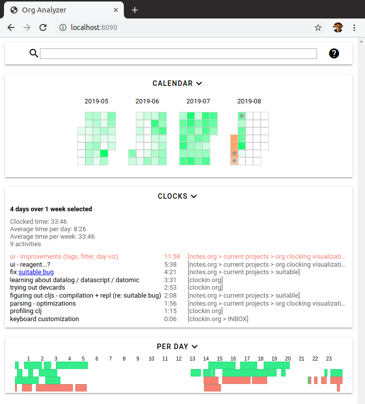

# org-analyzer

org-analyzer creates an interactive visualization of org-mode time-tracking
data. Org allows to add start/end timestamps to org items (via `org-clock-in`).
This makes it possible to create workflows that capture the times spend working
on particular things. Unfortunately the reporting features built into org are
rather limited. This tool remedies that fact by providing a visual and
interactive presentation of time capture data.




## Installation

You will need to have java installed to run org-analyzer.

### Standalone

Download the [latest jar file]() and run it (double click or from command line,
see [Usage](#Usage) below).

### Emacs

org-analyzer is on MELPA. Make sure MELPA is in your `package-archives`:

```elisp
(require 'package)
(add-to-list 'package-archives '("melpa" . "http://melpa.org/packages/"))
```

Then run `(package-install "org-analyzer")`. Afterwards, you can start the tool
via `M-x org-analyzer-start`.


## Usage

You start org-analyzer either directly via [a jar file you can download here](TODO)
or by starting the tool from within emacs. It will bring up a page in your
default web browser that displays the clock data found in your org files.

When using the jar file, place it in the directory where your org files are
located and double click it or start from a terminal via 
`java -jar org-analyzer-0.1.0.jar`.


### Command line options

Command line options from `java -jar org-analyzer-0.1.0.jar --help`:

```
```


## License

[GPLv3](LICENSE)
