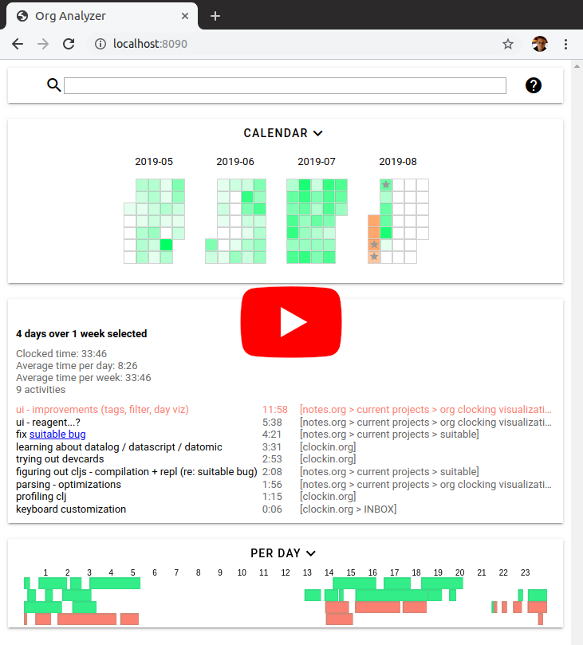

# org-analyzer

org-analyzer creates an interactive visualization of org-mode time-tracking
data. org-mode allows to add start/end timestamps to org-mode items (via
`org-clock-in`). This makes it possible to create workflows that capture the
times spend working on particular things. Unfortunately the reporting features
built into org-mode are rather limited. This tool remedies that fact by
providing a visual and interactive presentation of time-tracking data.

In other words, org-analyzer converts something like this

```org
* current projects
** org clockin visualization
*** ui - improvements (tags, filter, day viz)
:LOGBOOK:
CLOCK: [2019-08-04 Sun 23:35]--[2019-08-04 Sun 23:49] =>  0:14
CLOCK: [2019-08-04 Sun 13:51]--[2019-08-04 Sun 15:06] =>  1:15
CLOCK: [2019-08-04 Sun 04:25]--[2019-08-04 Sun 05:16] =>  0:51
...
:END:
```

into something like this:

[](https://www.youtube.com/watch?v=qBgvGDOxmUw)


## Usage

org-analyzer should run on all platforms that can run JAVA — but you will need
to have that installed.

### Standalone

Download the [latest jar file](https://github.com/rksm/clj-org-analyzer/releases/latest)
and run it! (double click or from command line, see below).

### Emacs

*2019-08-13: MELPA package is pending, see [the melpa pull request](https://github.com/melpa/melpa/pull/6365).*

For the time being, emacs support can be enabled by downloading the [emacs package](https://github.com/rksm/clj-org-analyzer/releases/download/0.3.0/org-analyzer-for-emacs-0.3.0.tar.gz) directly, extracting it and adding it to your load path and require it:

```elisp
(add-to-list 'load-path "/path/to/org-analyzer-0.3.0/")
(require 'org-analyzer)
```

Afterwards, you can start the tool via `M-x org-analyzer-start`.


<!-- org-analyzer is on MELPA. Make sure MELPA is in your `package-archives`: -->

<!-- ```elisp -->
<!-- (require 'package) -->
<!-- (add-to-list 'package-archives '("melpa" . "http://melpa.org/packages/")) -->
<!-- ``` -->

<!-- Then run `(package-install "org-analyzer")`. Afterwards, you can start the tool -->
<!-- via `M-x org-analyzer-start`. -->


## Commandline

Download the lates jar as described above and start it with `java -jar org-analyzer-0.3.0.jar`.

The following command line options are available, as per `java -jar org-analyzer-0.3.0.jar --help`:

```
Usage: java -jar org-analyzer-0.3.0.jar [opt*] [org-file-or-dir*]

Interactive visualization of timetracking data (org clocks).

This command starts an HTTP server that serves a web page that visualizes the
time data found in org files. Org files can be specified individually or, when
passing a directory, a recursive search for .org files is done. If nothing is
specified, defaults to the current directory, recursively searching it for any
.org file.

opts:
     --host hostname	Sets hostname, default is localhost
 -p, --port portnumber	Sets port, default is 8090
     --dontopen		Don't automatically open a web browser window

For more info see https://github.com/rksm/cljs-org-analyzer.
```


## License

[GPLv3](LICENSE)
